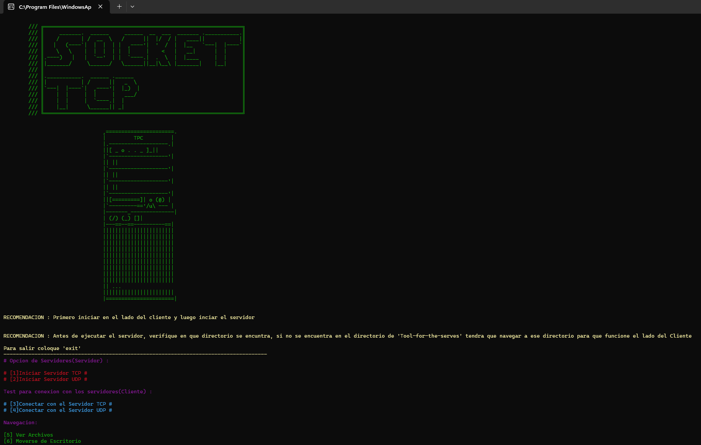

# Socket TCP
Esta Herramiente sirver para crear servidores `TCP` y `UDPC` simples, con testeo de conexiones de cliente

# Requiments y modulos a instalar
El unico modula a descargar es el modulo de `Colorama`, para descargar `Colorama` ejecuten este codigo en su terminal `pip install colorama`

# Imagenes 
